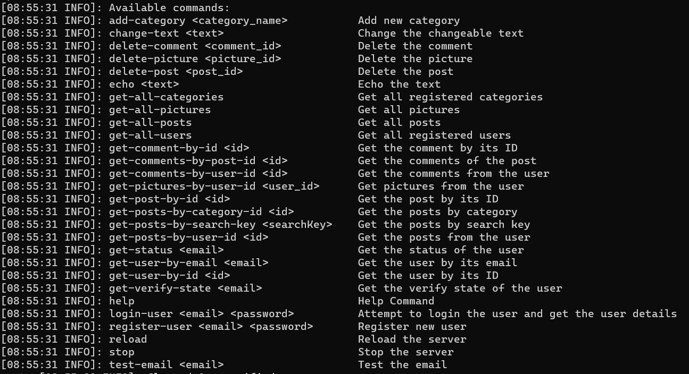

# Requires
* An operating system supports Java (Linux recommended, but Windows is also fine)
* Java 8 or higher (AdoptOpenJDK recommended)

# Install
1. Download the JAR file
2. Open the terminal on the folder that the file is downloaded on
3. Run the command `java -jar ImageExpBackend.jar`
4. Wait for the server to load
5. On the folder, open `config.yml`
6. Change some settings
7. Back to the terminal, type `reload` and press Enter
8. Enjoy

* If you want to stop the server, type `stop` on the terminal and press Enter

# Operate
On the terminal, Type `help` and press Enter to get the list of available commands you can use to interact with the server

